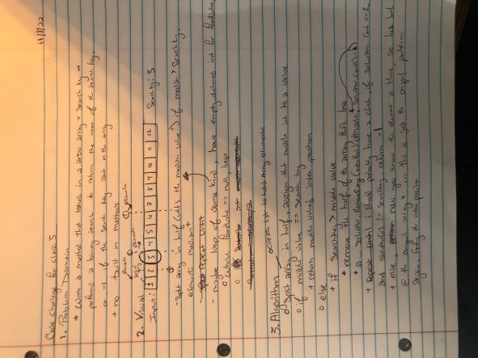

# Code Challenge: Class 03- Binary Search of Sorted Array

## Description

Feature Tasks

1. Write a function called BinarySearch which takes in 2 parameters: a sorted array and the search key. Without utilizing any of the built-in methods available to your language, return the index of the array’s element that is equal to the value of the search key, or -1 if the element is not in the array.
2. NOTE: The search algorithm used in your function should be a binary search.
Check the Resources section for details

Stretch Goal

What would you need to change if the array contained objects (sorted on a given property), and you were searching for certain property value? Write out the pseudocode.

## Whiteboard Process

## Approach and Efficiency
