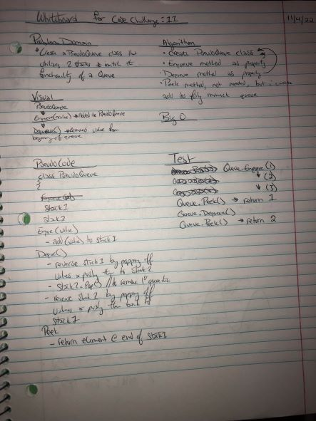

# Challenge Summary

Code Challenge: Class 11

## Whiteboard Process



## Approach & Efficiency

I initially approached this challenge by watching a couple videos about queues and stacks in c# on Youtube. Following that immediately coded what I thought was the result before realizing I just made a stack extension rather than creating a queue. That led to a couple of hours of failed coding intermixed with filling out my Readme file and whiteboarding. I then took a break because I realized I was getting absolutely nowhere staring at my screen. When I came back I realized the solution was simpler than what I initially thought and was able to complete the challenge in approx. 30 minutes.

## Solution

To run my code, you must instantiate a new instance of my PseudoQueue

```csharp

PseudoQueue myQueue = new PseudoQueue();
```

You'll then be able to use the same functionality you would with a built in c# queue: enqueue(), dequeue(), and peek()

```csharp
myQueue.Enqueue(25);
myQueue.Enqueue(23);
myQueue.Enqueue(20);
myQueue.Enqueue(12);
myQueue.Enqueue(11);
myQueue.Peek(); // returns 25, since it's the first in the queue
myQueue.Dequeue(); // removes 25 from the queue since its first in the queue, it's also first out the queue
myQueue.Peek() // returns 23
```
